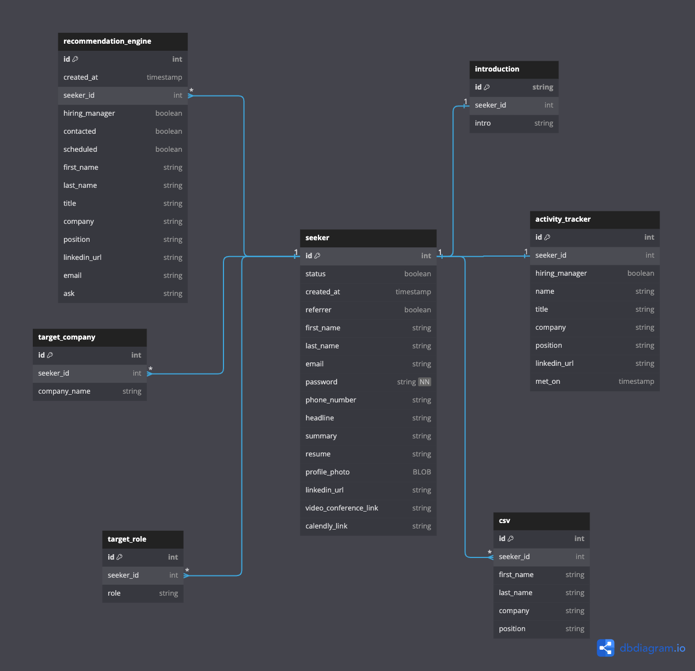

### Demo Link: TBD

#### Stack
 - Backend
   - Python/[Django](https://www.djangoproject.com/)
   - Testing -> [Django Test](https://docs.djangoproject.com/en/4.2/topics/testing/)
 - Frontend
   - [Django Template Language (DTL)](https://docs.djangoproject.com/en/4.2/topics/templates/)
   - [React with Material UI](https://mui.com/material-ui/getting-started/)
   - Testing -> Django Test / [django-test-plus](https://pypi.org/project/django-test-plus/)
 - Database
   - [Postgres](https://www.postgresql.org/)
 - CI
   - [Github Actions](https://github.com/features/actions)

#### Database Structure
Source: [Linktag Entity Relationship Diagram (ERD)](https://dbdiagram.io/d/648bed20722eb774940fe749)

