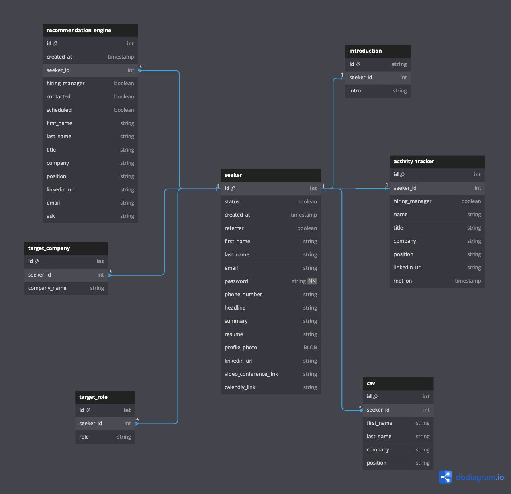

### Demo Link: [Linktag](https://linktag.fly.dev) 

#### Stack
 - Backend
   - Python/[Django](https://www.djangoproject.com/)
   - Testing -> [Django Test](https://docs.djangoproject.com/en/4.2/topics/testing/)
 - Frontend
   - [Django Template Language (DTL)](https://docs.djangoproject.com/en/4.2/topics/templates/)
   - React homepage with a shared, self-hosted design system
   - Testing -> Django Test / React Testing Library
 - Database
   - [Postgres](https://www.postgresql.org/)
 - CI
   - [Github Actions](https://github.com/features/actions)

#### Development and deployment

See [deployment.md](docs/deployment.md) for safe local test commands, the shared
Django/React asset pipeline, and automatic deployment to Fly.io on pushes to main.

#### Database Structure
Source: [Linktag Entity Relationship Diagram (ERD)](https://dbdiagram.io/d/648bed20722eb774940fe749)

